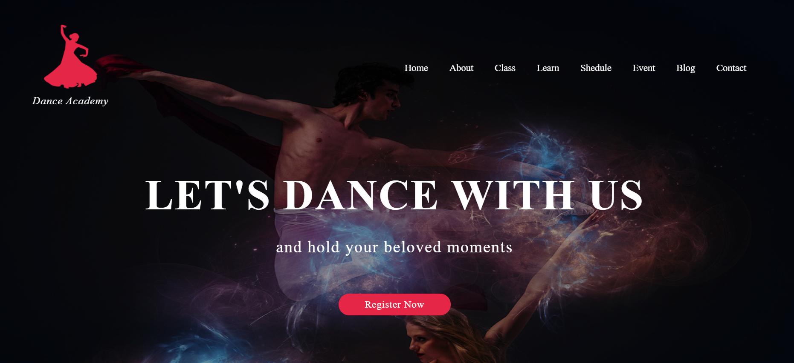

# Dance Academy Website

Welcome to the Dance Academy Website project! This project is a simple static website built using HTML, Bootstrap, and SCSS, featuring a light and dark theme toggle and a looping video element.

## Table of Contents

- [Features](#features)
- [Technologies Used](#technologies-used)
- [Demo](#demo)
- [Installation](#installation)
- [Usage](#usage)
- [License](#license)
- [Contact](#contact)

## Features

- Fully responsive design
- Clean and modern aesthetic
- Easy to customize with SCSS

## Technologies Used

- HTML
- Bootstrap
- SCSS
- JavaScript

## Demo



## Installation

To get a local copy up and running, follow these simple steps:

1. Clone the repo:
   ```sh
   git clone https://github.com/your-username/dance-academy-website.git
2. Open index.html in your browser to view the website.

## Usage
Once the project is set up, you can use the website to display details about your dance academy, including event details, class schedules, and instructor information

## License
Distributed under the MIT License. See LICENSE for more information.

## Contact
Manthan Thakor - thakormanthan849@gmail.com
## Project Link
Project Link: https://github.com/ManthanThakor/Dance-Academy-theme
